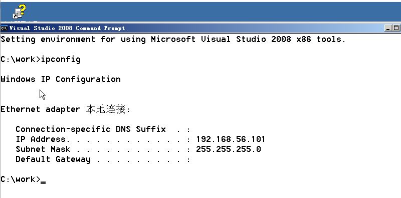
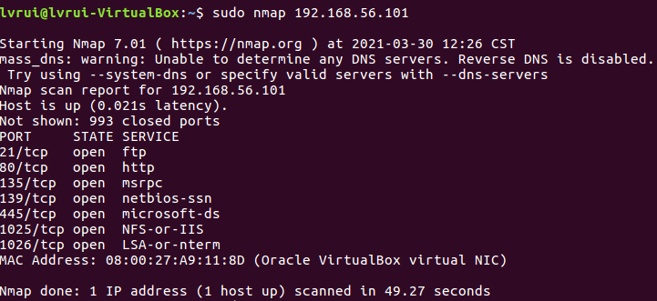
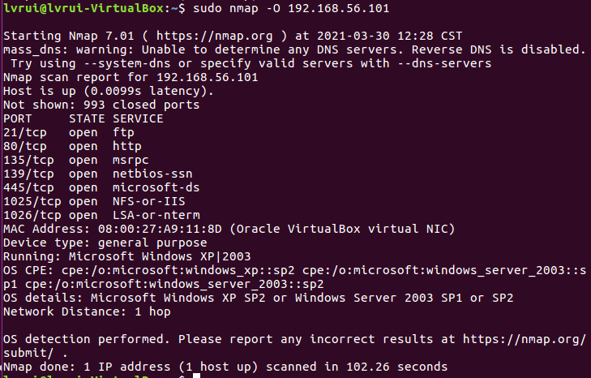
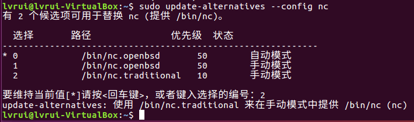
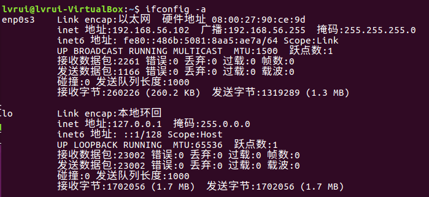
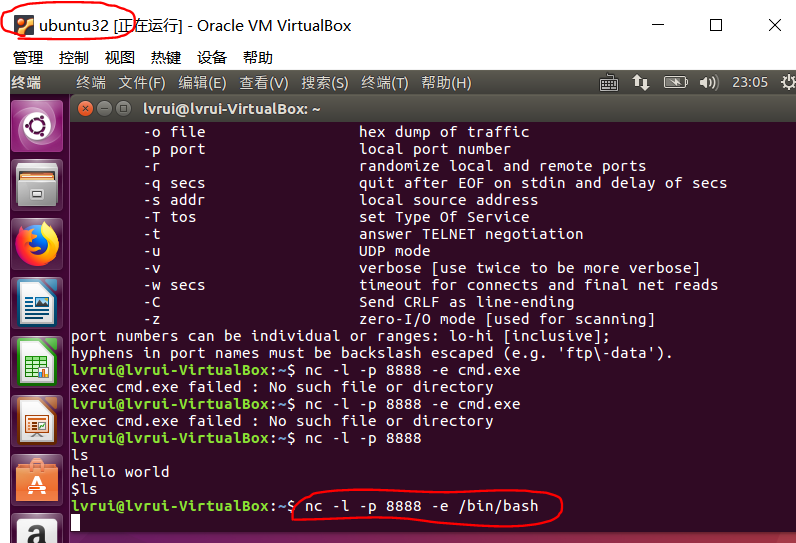
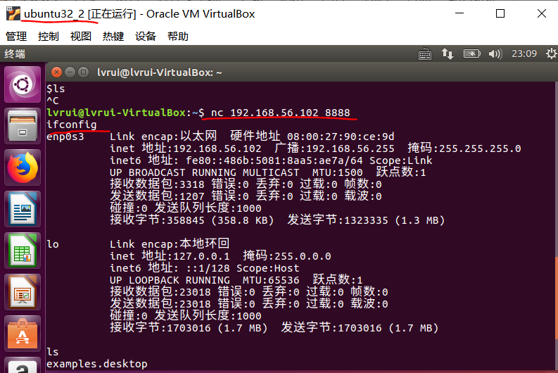

# lab1 网络安全基础实验

PB18111707 吕瑞

## Part 1

使用 ubuntu 虚拟机中的网络侦查工具 nmap，查看已下载的 Windows 2003 虚拟机中开放了哪些网络端口，用 nmap 探测 Window 2003 虚拟机的操作系统类型。

1. 下载 nmap

    ```
    $ sudo apt -y install nmap
    ```

    

2. 将 Windows 2003 的网络模式设置为桥接网卡。

    打开 Windows 2003 虚拟机，获取该虚拟机的 ip 地址。

    

    

3. 在 ubuntu 中使用 nmap 工具探测 Windows 2003 虚拟机中开放的网络端口

    

    

4. 使用 nmap 探测 Windows 2003 虚拟机的操作系统类型

    


## Part 2

在 ubuntu 虚拟机中用经典的网络安全工具 netcat 在本机开启一个监听端口，实现远程木马的功能。

1. ubuntu 上默认安装的是 netcat-openbsd，不能开启监听端口，所以首先下载经典的 netcat-traditional 

    ```
    $ sudo apt-get -y install netcat-traditional
    ```

    接下来设置默认的 nc 版本：

    ```
    sudo update-alternatives --config nc
    ```

    

    

2. 获取主机 ubuntu32 的 ip 地址

    ```
    $ ifconfig -a
    ```

    

    主机 ip : `192.168.56.102`

3. 将主机 ubuntu32 （主机 A）作为 server，开启后门：

    

    

4. 主机 ubuntu32_2 （主机 B）作为 client：

    

    即可实现主机 B 对主机 A 的远程控制，在 B 中输入命令行，会返回在 A 中的执行结果。

